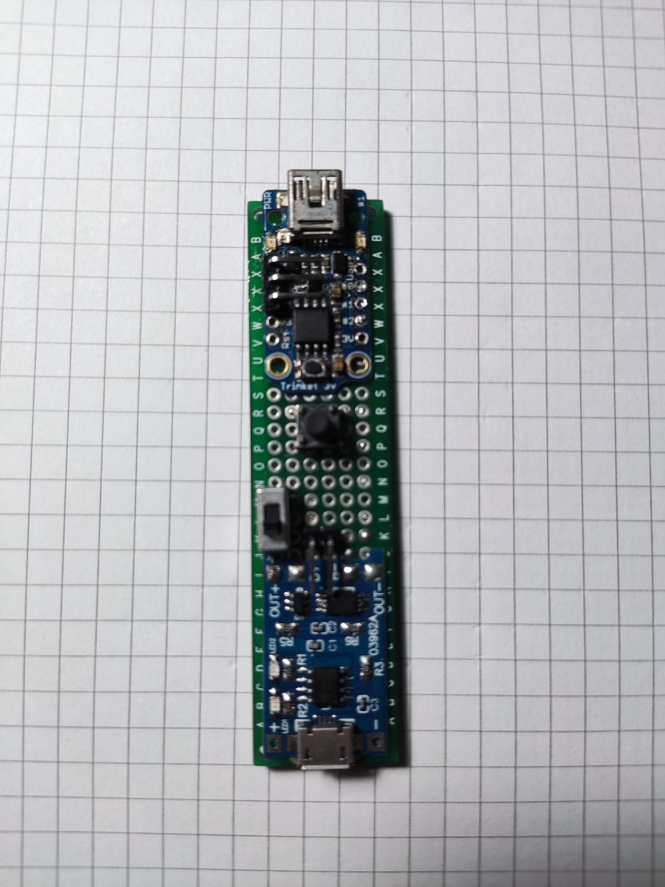

- [Preface](#preface)
- [Requirements](#requirements)
- [Hardware setup](#hardware-setup)
- [Build or edit firmware](#build-or-edit-firmware)
- [How does it work?](#how-does-it-work)
  - [Project tree](#project-tree)

# Preface

**Iron Man** is an attempt to reproduce the first version of Iron Man hart using NeoPixel ring for my son.

# Requirements

- [Platform IO](https://docs.platformio.org/en/latest/)
- [Trinket 3v](https://www.adafruit.com/product/1500)
- [Neo Pixel Ring](https://www.adafruit.com/product/1643)
- [Lipo Battery 3.7v](https://www.adafruit.com/product/258)
- [Battery Charger]()
- [Switch]()
- [Button]()

# Hardware setup

To build the hardware I've used a stripboard of





# Build or edit firmware

Just open the project with [Platform IO](https://docs.platformio.org/en/latest/) and you are ready to make your changes and upload it.

# How does it work?

The project is making use of the famouse [FastLED](https://github.com/FastLED/FastLED/wiki/Basic-usage) library to managing the Neo Pixel ring. The only present effect for now is the `hartbeat` and is built with no-blocking in mind. This because the device has a button to control the colors of the ring.

## Project tree

```
.
├── extras
│   ├── pcb-full.jpg
│   ├── pcb-side-1.jpg
│   ├── pcb-side-2.jpg
│   ├── sketch.jpg
│   └── sketch-mirrored.jpg
├── include
│   ├── IronMan.h
│   └── README
├── lib
│   └── README
├── platformio.ini
├── README.md
├── src
│   └── IronMan.cpp
└── test
    └── README
```